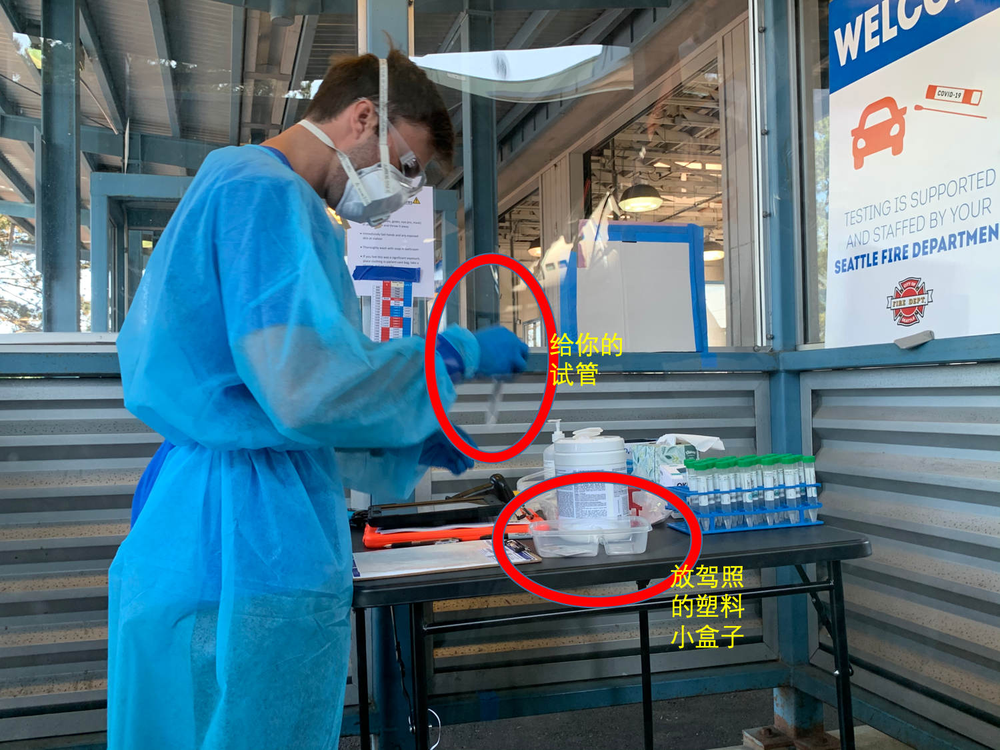
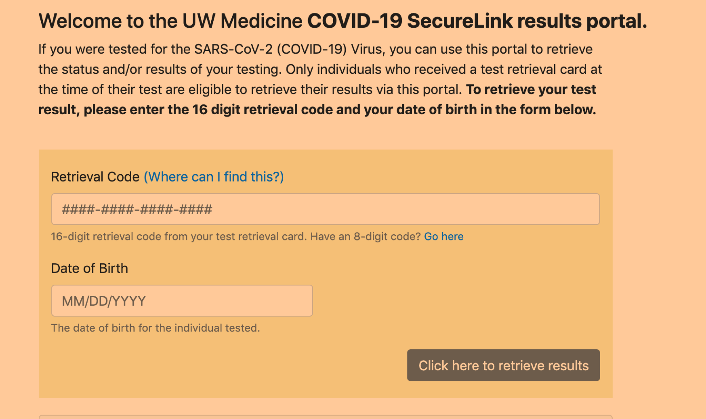

# 西雅图免费快速测新冠指南

## 目录

- [新冠免费测试点](#新冠免费测试点)
   * [可网上预约测试点(推荐)](#可网上预约测试点(推荐))
   * [其他测试点](#其他测试点)
- [Aurora测试点体验](#Aurora测试点体验)
  * [1.网上预约](#1.网上预约)
  * [2.测试地点情况](#2.测试地点情况)
    * [Drive-in](#Drive-in)
    * [Walk-in](#Walk-in)
  * [3.Drive-in测试过程](#3.Drive-in测试过程)
    * [第一步：登记](#第一步：登记)
    * [第二步：取样](#第二步：取样)
  * [4.测试结果查询](#4.测试结果查询)
- [其他](#其他)

## 新冠免费测试点
详见[金县官网](https://kingcounty.gov/depts/health/covid-19/care/testing/locations.aspx)， 下面只列出西雅图测试点。Kent, Bellevue 等请点官网。

### 可网上预约测试点(推荐)
| Tips: Aurora测试点也可以不预约直接walk-in or dirve-in. 但是去了还是要填网上预约的表。所以建议提前网上预约填好，节省时间和在测试点的人员接触 |
| --- |
1. City of Seattle at Aurora (North Seattle)
    - 12040 Aurora Ave N., Seattle, WA 98133
    - Phone: (206) 684-2489
    - Languages: Interpretation available
    - [Aurora预约网址](https://www.solvhealth.com/book-online/gdLDbg)

2. City of Seattle at SODO (South Seattle)
    - 3820 6th Ave S., Seattle, WA 98108
    - Phone: (206) 684-2489
    - Available, Mon.-Sat., 10am - 3 pm
    - Languages: Interpretation available
    - [SODO预约网址](https://www.solvhealth.com/book-online/0xvwjp)

### 其他测试点
| Tips: No appointment necessary的信息不准确。我去了Sea Mar Community Health Centers at South Park，发现并不可以walk-in,而是要打电话预约，然而电话转来转去并不好打通，所以强烈建议去可网上预约的测试点。 |
| --- |
- Downtown Public Health Center
    - No appointment necessary
    - 2124 4th Ave., Seattle, WA 98121 (behind building)
    - Phone: (206) 477-8300
    - Languages: Interpretation available
Neighborcare Health at Meridian (North Seattle)
10521 Meridian Ave N., Seattle, WA 98133
Phone: (206) 296-4990
Languages: Amharic, Somali, Spanish, Tagalog, Vietnamese; interpretation available

- Neighborcare Health at Rainier Beach (South Seattle)
    - 9245 Rainier Ave S. 2nd Floor, Seattle, WA 98118
    - Phone: (206) 722-8444
    - Languages: Amharic, Arabic, Cham, French, Malay, Somali, Spanish, Tagalog, Tigrinya, Vietnamese; interpretation available

- Neighborcare Health at High Point (West Seattle)
    - 6020 35th Ave SW, 1st Floor, Seattle, WA 98126
    - Phone: (206) 461-6950
    - Languages: Amharic, Arabic, Cambodian, Oromo, Russian, Somali, Spanish, Ukrainian; interpretation available

- Sea Mar Community Health Centers at South Park
    - 8720 14th Ave S, Seattle, WA 98108
    - Phone: (253) 681-6600
    - Languages: Spanish, Interpretation available

- Sea Mar Community Health Centers at White Center
    - 9650 15th Ave SW #100, Seattle, WA 98106
    - Phone: (206) 965-1000
    - Languages: Spanish, Interpretation available

- UW Mobile Clinic at Rainier Beach High School
    - 8815 Seward Park Ave S, Seattle, WA 98118
    - Phone: (206) 744-0400
    - (Open Wed. and Sat., 10am-3pm, no appointment necessary)
    - Languages: Interpretation available

- UW Mobile Clinic at South Seattle College
    - 6000 16th Ave SW, Seattle, WA 98106
    - Phone: (206) 744-0400
    - (Open Fri., 10am-3pm, no appointment necessary)
    - Languages: Interpretation available

## Aurora测试点体验

### 1.网上预约
Aurora预约网站：https://www.solvhealth.com/book-online/gdLDbg

点进去后，选择测试时间，然后填写个人信息和保险信息。

Tips: 
1. 你会发现测试时间只能选几天以后的，但是如果你很急，一直刷slot可能会刷到当天的。我是下午3:30刷到3：45的slot。有点像刷AmazonFresh slot。
2. 测试迟到没有关系，我预约的3:45实际4:00才到测试点，然后还排了几十分钟队。我猜测只要在预约时间后，关门时间前去即可。
3. 不用担心填保险信息会收到账单，金县给出的解释是：他们先会bill保险公司，如果保险公司拒赔的话，会从金县covid基金里出。所以一定免费！
4. 如何取消预约？预约后会收到邮件和短信，里面有link可以直接取消。

### 2.测试地点情况

#### Drive-in
- Drive-in有5条lane。有点像高速收费站排队。路口有人员问你有没有预约，然后安排你去某条lane排队。快排到时会有医务人员询问你有没有预约，如果没有，会让你在一个类似ipad的东西上填写信息。如果有预约，只要等待就好了。

#### Walk-in
- 测试点旁边有两个棚子，我猜是给没有开车的人测试点。也要排队，填表，图片为医务人员在取样。

### 3.Drive-in测试过程

**整个测试分两步。** 需开车依次经过两个窗口。整个过程非常快。

#### 第一步：登记
医生会让你把驾照放到一个塑料小盒里，然后他会回到工作台面填写信息，接着他会给你：
* 一个取样试管，请核实姓名和生日
* 你的驾照  
* 一张纸，上面有查询结果的网址，属于你的二维码和提取码。

#### 第二步：取样
 医生取回小试管。取样的过程非常难受：医生会拿一个取样棒插入鼻孔深处，左右鼻孔各捅五秒。你需要在她转动取样棒的过程中保持呼吸。会流泪！我好长时间没晃过来。
 
 然后就可以开车回家等待结果了！**一般48小时内会出结果。** 但可能现在测试的人比较多，我等了60小时。

### 4.测试结果查询

测试结果查询网址：https://securelink.labmed.uw.edu/
需填入提到的提取码和你的生日。

### 其他
1. 保险公司会报销covid测试吗？这里介绍的测试地点都是免费的。但是如果你去某些clinics做测试未必免费，可能需要你的家庭医生refer或者in-network才可以报销，请打保险公司电话咨询。

2. 疫情期间各种事情可以先打电话确认再出行。
