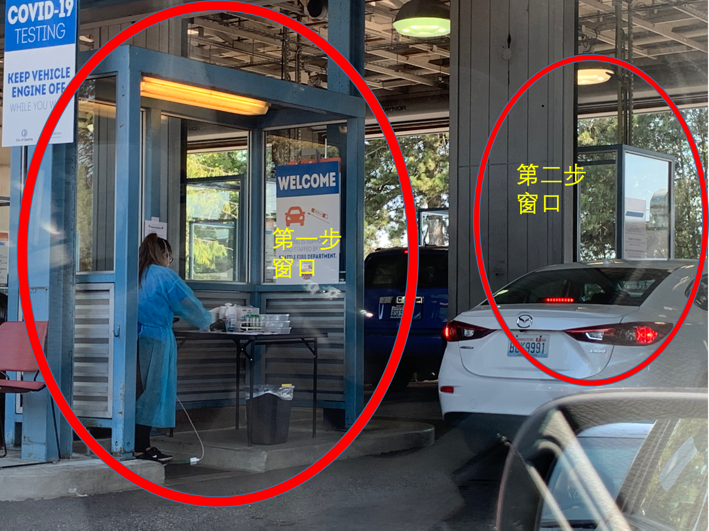

# How to take a  FREE COVID19 TEST in SEATTLE

## Table of Contents

- [Free COVID19 Testing Locations](#Free-COVID19-Testing-Locations)
   * [Loations with online reservation](#Loations-with-online-reservation)
   * [Other Locations](#Other-Locations)
- [My Aurora Test Experience](#My-Aurora-Test-Experience)
  * [1. Online Reservation](#1-Online-Reservation)
  * [2. Available Types of Testings](#2-Available-Types-of-Testings)
    * [Drive-in](#Drive-in)
    * [Walk-in](#Walk-in)
  * [3. Drive-in Process](#3-Drive-in-Process)
    * [Check in](#Check-in)
    * [Test](#Test)
  * [4. Get results online](#4-Get-results-online)
- [Other](#Other)

## Free COVID19 Testing Locations
Details can be found at [King County Website](https://kingcounty.gov/depts/health/covid-19/care/testing/locations.aspx). Here I only listed Seattle free testing locations. Please refer the official website link for Kent, Bellevue, Renton etc locations.

### Loations with online reservation
**Highly recommended!**
| Tips: With online reservation, you can still go Aurora Testing Site for walk-in or drive-in. You will need to fill the same form at the site. If it will save your time and limit your access to others if you fill the forms online before you go. |
| --- |
1. City of Seattle at Aurora (North Seattle)
    - 12040 Aurora Ave N., Seattle, WA 98133
    - Phone: (206) 684-2489
    - Languages: Interpretation available
    - [Aurora Online Reservation](https://www.solvhealth.com/book-online/gdLDbg)

2. City of Seattle at SODO (South Seattle)
    - 3820 6th Ave S., Seattle, WA 98108
    - Phone: (206) 684-2489
    - Available, Mon.-Sat., 10am - 3 pm
    - Languages: Interpretation available
    - [SODO Online Reservation](https://www.solvhealth.com/book-online/0xvwjp)

### Other Locations
| Tips: `No appointment necessary` is not accurate. I went to Sea Mar Community Health Centers at South Park. It turned out that I couldn't walk-in, but needed to make a phone call for reservation first. However, the call was hard to get through. Therefore, locations allowing online reservations are more preferred IMHO.|
| --- |
- Downtown Public Health Center
    - No appointment necessary
    - 2124 4th Ave., Seattle, WA 98121 (behind building)
    - Phone: (206) 477-8300
    - Languages: Interpretation available
Neighborcare Health at Meridian (North Seattle)
10521 Meridian Ave N., Seattle, WA 98133
Phone: (206) 296-4990
Languages: Amharic, Somali, Spanish, Tagalog, Vietnamese; interpretation available

- Neighborcare Health at Rainier Beach (South Seattle)
    - 9245 Rainier Ave S. 2nd Floor, Seattle, WA 98118
    - Phone: (206) 722-8444
    - Languages: Amharic, Arabic, Cham, French, Malay, Somali, Spanish, Tagalog, Tigrinya, Vietnamese; interpretation available

- Neighborcare Health at High Point (West Seattle)
    - 6020 35th Ave SW, 1st Floor, Seattle, WA 98126
    - Phone: (206) 461-6950
    - Languages: Amharic, Arabic, Cambodian, Oromo, Russian, Somali, Spanish, Ukrainian; interpretation available

- Sea Mar Community Health Centers at South Park
    - 8720 14th Ave S, Seattle, WA 98108
    - Phone: (253) 681-6600
    - Languages: Spanish, Interpretation available

- Sea Mar Community Health Centers at White Center
    - 9650 15th Ave SW #100, Seattle, WA 98106
    - Phone: (206) 965-1000
    - Languages: Spanish, Interpretation available

- UW Mobile Clinic at Rainier Beach High School
    - 8815 Seward Park Ave S, Seattle, WA 98118
    - Phone: (206) 744-0400
    - (Open Wed. and Sat., 10am-3pm, no appointment necessary)
    - Languages: Interpretation available

- UW Mobile Clinic at South Seattle College
    - 6000 16th Ave SW, Seattle, WA 98106
    - Phone: (206) 744-0400
    - (Open Fri., 10am-3pm, no appointment necessary)
    - Languages: Interpretation available

## My Aurora Test Experience

### 1. Online Reservation
Aurora Online Reservation Webstie：https://www.solvhealth.com/book-online/gdLDbg

Click the link, you will see below page. Find the available time slot and fill in your personal and insurance information.

Tips: 
1. Usually the available slots are several days' later. However, you may be lucky to find the same day slot if you keeps refreshing the page. I booked a 3:45pm slot at 3:30. 
2. It is OK to be late for the appointment. I arrived 4:00pm for my 3:45pm test. I guess it may be fine as long as it is after your appointment time and before they are closed.
3. It is *FREE* ! Why do they ask for insurance information? Here is the explanation: They will bill insurance company first, if insurance refuses to pay, they will pay with King County COVID Fundings.
4. How to cancel the appointment? You will receive a text message and email once book successfully. There is a link there to cancel appointment.

### 2. Available Types of Testings 

#### Drive-in
- There are 5 testing lanes for Drive-in. A person at the curb would ask you if you have appointment and point you to one lane to wait. Once you are close to tesing booth, another person will ask if you have an online appointment again, and hand you a pad to fill in information if you don't.

#### Walk-in
- There are two testing booths at curb. I guess they are used for walk-in. You still need to fill the forms if you haven't filled online. The picture showed the doctor doing the test for a lady.

### 3. Drive-in Process

**Two steps for Drive-in!** You will drive through two booths one after another. The process is super fast, less than 10min.

#### Check in
In the first booth, the doctor asked me to put my driver licence in a small plastic container. After finishing some paper work at his desk himself, he returned me:
* A test tube，asking me to verify birth date and name.
* My driver licence
* A paper with instructions to find the testing result later online.**Saved this for result retrieval code!**

#### Test
In the second booth, another doctor took back the test tube and gave me the test. It felt really uncomfortable: she inserted a sampling rods deeply into my nose, 5 second for each nostril, asking me to keep breathing during the process. I shed tears immediately.

Then it is time to go home and rest! **It usually takes 48 hours to get the result online.** It took me around 60 hours, maybe due to high testing flow.
 
### 4. Get results online

Result searching page：https://securelink.labmed.uw.edu/

It will ask for your birth date and retrieval code which can be found in the paper given to you during the check-in of the testing.

### Other
1. Does insurance company cover COVID19 tests? It depends. You may need your doctor's referal and check if the clinics is in-network. Call insurance company to understand their policy. **But the locations listed here are free even if insurance refuses to cover.**

2. It is worth checking everything with a phone call before heading there directly.

3. Big thanks and respect to King County offering the free test and medical workers for their hard work! Stay safe and well, everyone!